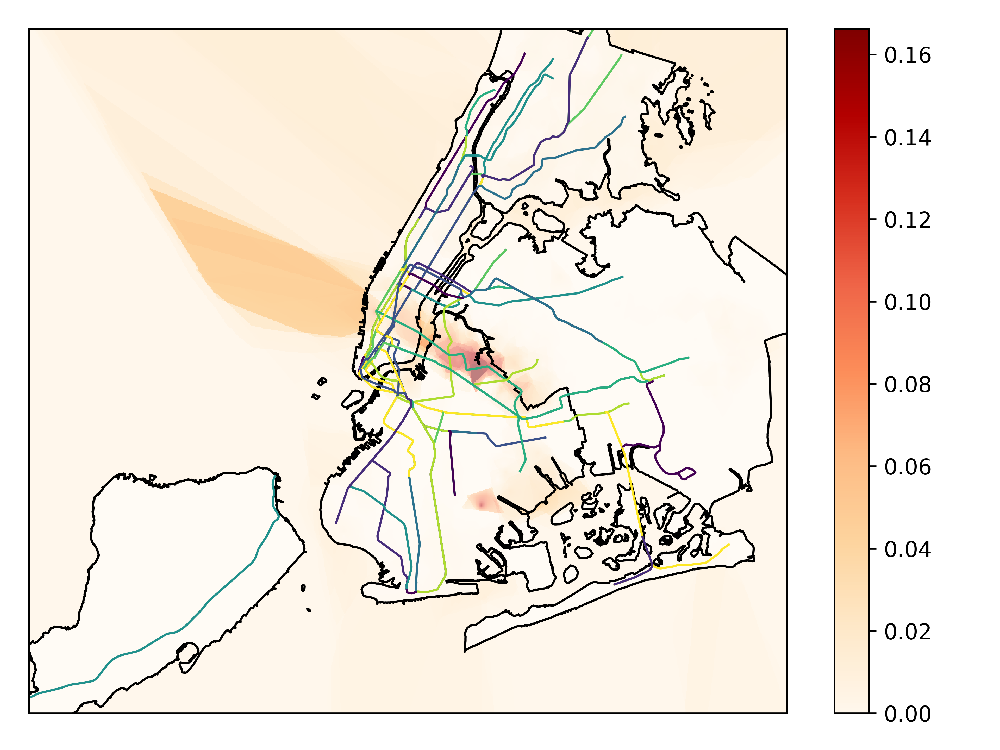
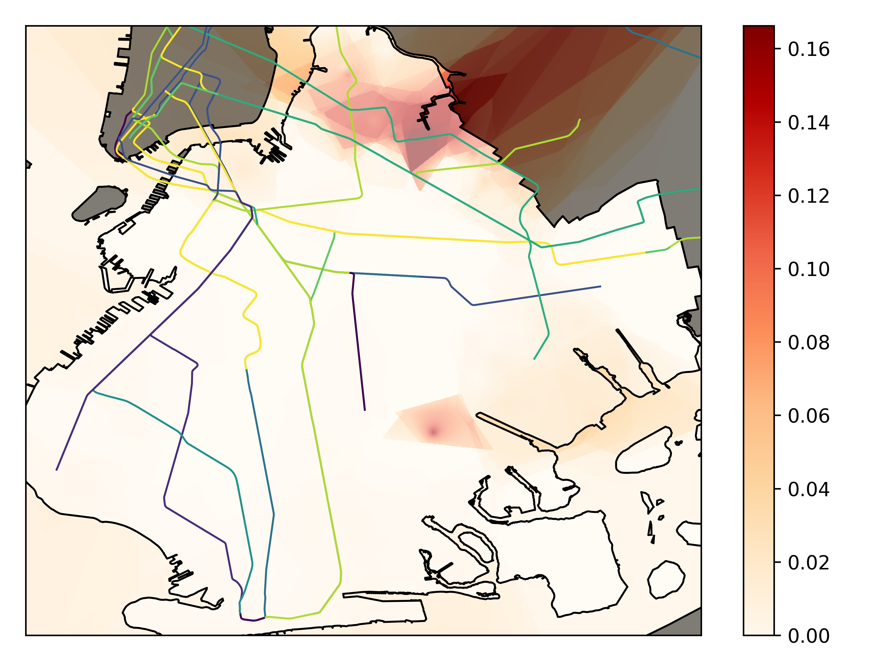
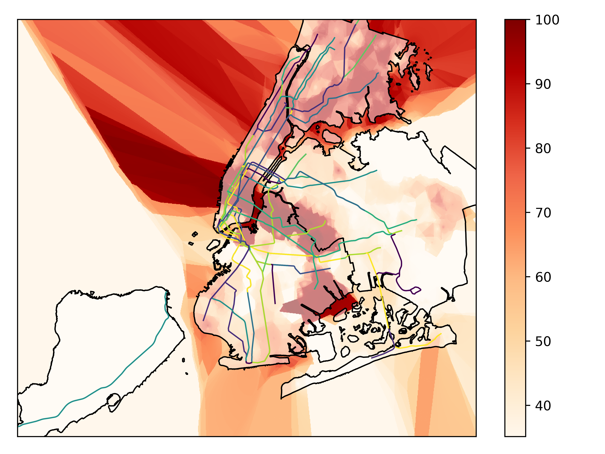
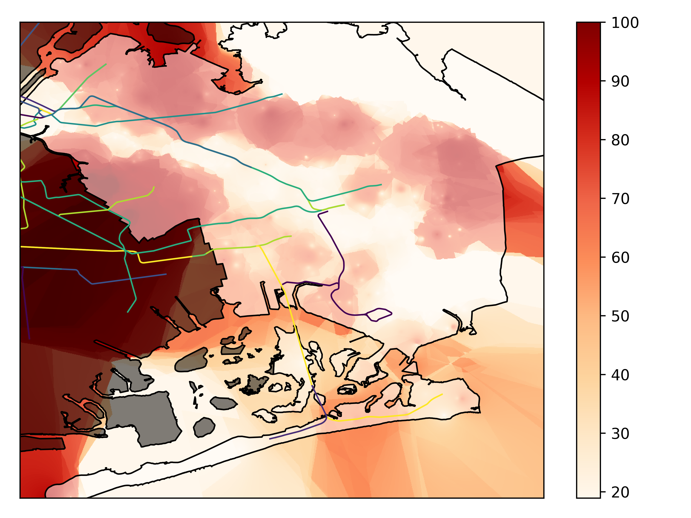

# LPocalypse

If you live in NYC, you've certainly been hearing about the MTA this summer. From derailments in Harlem to signal problems in Herald Square, trains have been running hot, slow, and crowded, when they're running at all. Added to this is the one thing all New Yorkers know is going to happen: the L is going to be shut down for 15 months. While this investment into the city's infrastructure is universally accepted as good, not having this critical vein for public transport has many people groaning. In many ways, the shutdown of the L will be a bit of a test case for when subsequent lines go down for maintenance in years to come.

When it comes to lines closing for a period of months or years, most people think that only the neighborhoods that a line runs through will be affected. For the L train, it is thought that Williamsburg will be the main area hit by the closure. In this analysis, we question that conclusion and look at how travel times around the city will be affected by the closure of a single line and how closing even a single line can affect residents of far-flung neighborhoods.

## Methodology

There are already [maps](http://transit.sidewalklabs.com) that show how
transit times _from a particular point_ will be affected by the L shutdown.
However, we are curious what the disparate impacts are of these transit time
differences.

In order to do this, we sample locations within the five boroughs and also
sample a time of day that is characteristic for train usage (as given by the MTA
turnstile data). Given these two pieces of information, we calculate the transit
times from that point to all other points in the boroughs with and without the
L. The transit times we use include transfers and buses and, since this is New
York, a maximum walking distance of 2.5 miles.

From this, we'd like to see what the impact of the train shutdown is for that
sampled location. One piece of information we _don't_ have is where people are
traveling to from that source location. We instead make the assumption that
people go to places that are reasonably quick to get to from their location [but they don't generally ride the subway <3 stops... they go a middle distance]. Under this
assumption, the inverse travel time to a location correlates with the probability
of a person traveling there.

Now, we have two maps that correlate to where people will likely go with the L
up-and-running and with the L shut down. In order to distil this into a number
representing the impact of the shutdown, we calculate the earth movers distance
between the two maps using the physical distances between points.

This earth movers distance can be thought of as how much effort it would take to
"move" travel preferences around the physical map from what it looks like with
the L versus without the L. Using the physical distances between the points makes
it so that even if your travel time to 14th and 1st goes up, faster travel time
to Union Square can compensate but travel times to Coney Island don't.

## Results

With these methods, we see some things we expect and some things that are quite
shocking! Looking around all the boroughs, we see what we'd expect to see:
Williamsburg, Ridgewood and (to some degree) Bushwick are the most affected. We
don't, however, see much of an impact in the East Village because of the
prevalence of buses and the proximity to other trains.

Interestingly, we also see that Mills Basin (and Canarsie to some degree) are
affected. In those areas, the best way into Manhattan is to take the B6/B82 bus
(or a 30min walk) to Rockaway Parkway station on the L. Without the L, the only
ways into Manhattan require long trips on buses to get to other trains. This is
also true, to some extent, for southern East New York and Brownsville where the
L train is the closest available train.

In order to dig deeper, we look at what percentile of impact each area is in.
It's important to realize that we're doing this because, in general, either you
are extremely affected or you are not affected much at all! This is a good sign
for the majority of New Yorkers, but it's still interesting to see just how wide
ranging the effects of the L shutdown can be.

There are interesting things going on in this map! First, we can see that all of
Manhattan and the Bronx are quite high in the impact ratings. This makes sense
because the only alternatives for getting into L-territory are the
harder-to-reach J and M trains, or a lengthy transfer to the G. In general,
Brooklyn is much less impacted than we may have otherwise thought because of the
range of alternate trains. For Manhattan and the Bronx, getting to those
alternate lines is now more cumbersome.

Another interesting location is Flushing in Queens. After some digging, it seems
that, although travel to most of NYC remains unaffected, travel times to
Canarsie goes through the roof with 30min or more in travel times. In addition,
most of Queens gets a non-negligible impact because of the inaccessibility to the
East Village.
